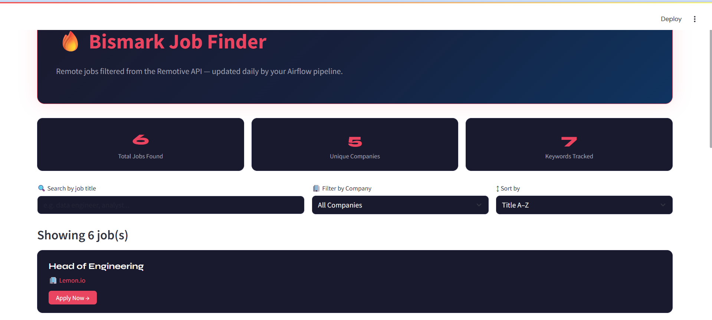
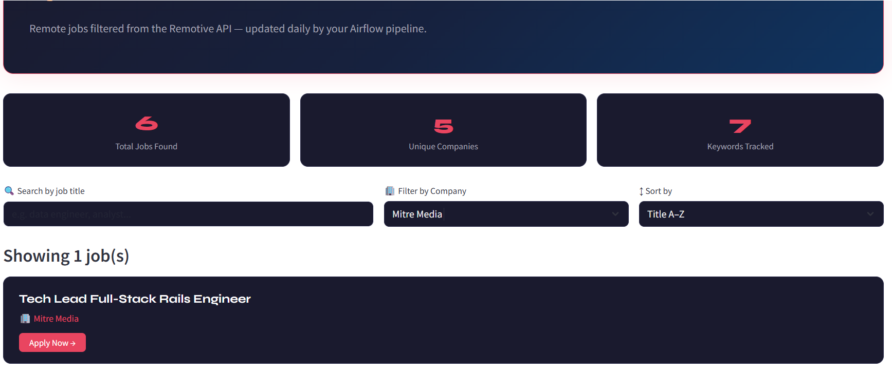

# 🔥 AI Job Intelligence Pipeline

An end-to-end job intelligence system that automates job discovery and presents filtered job listings with direct application links — powered by Airflow, Python, and Streamlit.

---

## 🚀 Features

- Automated job data pipeline using Apache Airflow
- Fetches live job listings from the Remotive API
- Filters jobs based on relevant roles (Data, Engineering, Customer Service, Warehouse)
- Displays jobs in an interactive Streamlit web app
- Search, sort, and filter by title or company
- Direct **Apply Now** links for each listing
- One-click CSV export of filtered results

---

## 🧠 Tech Stack

| Tool | Purpose |
|---|---|
| Python | Core scripting and data processing |
| Apache Airflow | Pipeline orchestration and scheduling |
| Streamlit | Interactive web UI |
| Pandas | Data manipulation and filtering |
| Docker | Containerized Airflow environment |

---

## 📊 How It Works

```
Airflow DAG
    │
    ├── fetch_jobs()       → Pulls jobs from Remotive API → saves to /tmp/jobs.json
    │
    └── filter_jobs()      → Filters by keywords → saves to /tmp/filtered_jobs.csv
                                        │
                                        ▼
                            Streamlit App (tracker.py)
                                        │
                                        ▼
                                  UI Display
                          (Search · Sort · Filter · Apply)
```

---

## 📸 Demo / Screenshots

### 🔍 Job Finder Dashboard


### 🔎 Search Feature


### 📂 Filter & Sorting



---


## 📁 Project Structure

```
airflow/
├── job_tracker/
│   └── job.py               # Airflow DAG (fetch + filter pipeline)
├── tracker.py               # Streamlit web app
├── filtered_jobs.csv        # Output from pipeline
└── README.md                # This file
```

---

## ▶️ Run Locally

### 1. Start Airflow in Docker
```bash
docker run -d \
  --name airflow \
  -p 8080:8080 \
  -v "$(pwd):/opt/airflow/dags" \
  apache/airflow:2.9.3 \
  standalone
```

### 2. Trigger the Pipeline
- Open `http://localhost:8080`
- Login with `admin` and your generated password
- Find `job_tracker_pipeline` → toggle ON → click ▶ to run

### 3. Extract the Output CSV
```bash
docker cp airflow:/tmp/filtered_jobs.csv ./filtered_jobs.csv
```

### 4. Launch the Streamlit App
```bash
pip install streamlit pandas
streamlit run tracker.py
```

Then open `http://localhost:8501` in your browser.

---

## 🔍 Keywords Tracked

`data` · `engineer` · `analyst` · `customer` · `support` · `warehouse` · `psw`

---

## 👤 Author

**Bismark Sarpong**  
Data Engineer | Data Analyst | AI & Machine Learning Enthusiast  

📍 Ottawa, Ontario, Canada 🇨🇦  

🎓 MSc in Data Science | MBA (HRM) | Postgraduate Certificate in AI (Business Applications)  

💻 Technical Skills:
- Programming: Python, SQL, HTML
- Data Engineering: Apache Airflow, ETL Pipelines, APIs, Docker (in progress), Databricks
- Data Analysis & Visualization: Power BI, Tableau
- Machine Learning & AI: Machine Learning, LLMs (Large Language Models), Agentic AI, AI Automation
- Tools & Technologies: Git, Streamlit, MySQL, Pandas

🧠 Interests:
- AI Automation & Intelligent Agents  
- Data Engineering Systems & Pipelines  
- LLM-powered Applications  
- Building Data-Driven Products  

🔗 GitHub: https://github.com/bissy0427  
🔗 LinkedIn: https://www.linkedin.com/in/bismark-sarpong-16785a264  

🚀 🚀 Currently building an AI-powered job intelligence system using Apache Airflow and Streamlit to automate job search, filtering, and application workflows.
